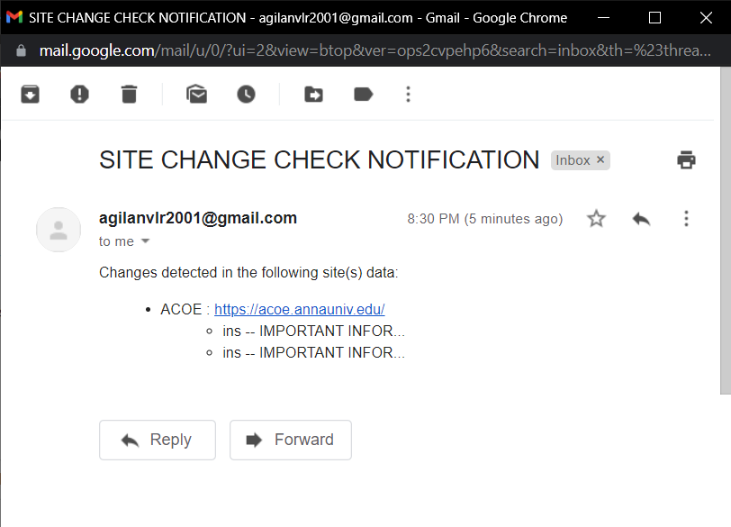

# Site-Change-Check
## GitHub Action Cron to check a list of Websites and notify for changes through Email

### Implementation - Overview

* NodeJs function is created to fetch the list of sites and compare (specific regions of the site) with the previous version of the sites which was saved in JSON format locally
* If a change is detected, an Email is sent and the JSON file is modified with the new site data, committed and pushed.
* NodeJs function is triggered with CronJob scheduled for every 30 minutes using GitHub Actions.

*Mail received after Site Change Detected*